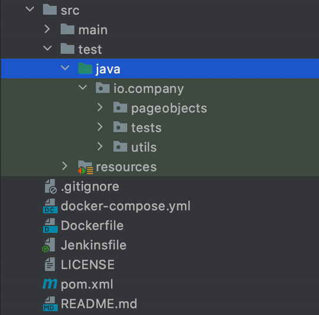
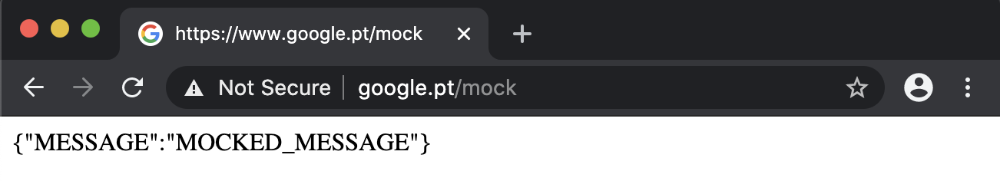

# Documentation
The following is a set of guidelines and documentation to better experience the test-automation-bootstrap's features. 
These are mostly guidelines, not rules. Use your best judgment, and feel free to propose changes to this document in a pull request.

## Contents
* [UI Tests](#ui-tests)
  * [POM](#pom---the-page-object-model)
  * [Suites](#suites)
  * [Parallel Test Execution](#parallel-test-execution)
  * [Extent Reports](#extent-reports)
  * [Mocking Responses](#mocking-responses)
  * [Checkstyle](#checkstyle)
* [Selenium Grid](#selenium-grid)
* [SonarQube](#sonarqube)
* [Jenkins](#jenkins-)
* [Elastic Stack](#elastic-stack)
  * [Distributed Test Reporting](#distributed-test-reporting)
  * [Service Monitoring](#service-monitoring)

## UI Tests
Built with _java-maven_ using the goods of [Selenide](https://selenide.org/), [TestNG](https://testng.org/doc/), [ExtentReports](https://extentreports.com/), [Checkstyle](https://maven.apache.org/plugins/maven-checkstyle-plugin/), [Lombok](https://projectlombok.org/), and some others. Here you'll find the boilerplate code you need to have your ui testing framework up and ready in no time.

### POM - the Page Object Model

The *ui-tests* uses the [Page Object Model](https://martinfowler.com/bliki/PageObject.html) to structure and organize its code. 



Within page objects you may find two kinds:
1. `Pages` complete page (eg. login page, home page)
1. `Components` reusable components within a page (eg. search bar, login form)

> **NOTE:** components are not supposed to be restricted to single pages. Components are designed to be reused throughout the framework. 
> Thus, if you've to group them, group them by component type, not page; eg. forms, sidebars, modals.

### Suites
You can have multiple suites under [/suites](../ui-tests/src/test/resources/suites). And, in order to run any of them you can use a system property `-Dsuite=<suite-name>`.

```shell script
$ mvn clean test -Dsuite=<suite-name>
```

> You can change the default suite on [pom.xml](../ui-tests/pom.xml) properties.

### Parallel Test Execution
You can run tests in parallel, configuring your suite file or with system properties.
 
 ```shell script
$ mvn clean test -Dparallel=<method-name> -Dthread.count=<n-threads>
```

### Extent Reports
Using [ExtentReports](http://www.extentreports.com/), you are able to automatically generate reports after test execution. These are stored under `reports/ExtentReport.html`. 
Furthermore, and by default, screenshots are taken upon test failure and attached to the report.

> ⚠️ Requires the extent report listener property to be set.
>
> Example: `-Dlistener=${package}/utils/listeners/ExtentReportListener.java`

### Mocking Responses
In order to mock http requests the framework uses browserup proxy behind selenide. This allows you to intercept, filter and manipulate requests and responses.



First you've to model your request, so you can work with it anyhow you see fit. 
Therefore, in order to create a new object to model a mocked request (eg. `ExampleMockModel.java`) it has to implement [MockDefinition](../ui-tests/src/test/java/io/company/utils/mocks/MockDefinition.java) interface.

````java
public class ExampleMockModel implements MockDefinition { ... }
````

Then, use the [@Mock](../ui-tests/src/test/java/io/company/utils/mocks/Mock.java) annotation in order to apply it for a given test case.

##### Snippet
```java
@Target(ElementType.METHOD)
@Retention(RetentionPolicy.RUNTIME)
public @interface Mock {
    Class<? extends MockDefinition>[] clazz();
}
```

The annotation may be declared for methods or class types.

````java
@Test
@Mock(clazz = {ExampleMockModel.class, OtherExampleMockModel.class})
public void exampleMockedTest() { ... }
````

⚠️ For this to work you have to enable the proxy and use the [MockListener](../ui-tests/src/test/java/io/company/utils/listeners/MockListener.java) class.

```shell script
$ mvn clean test -Dselenide.proxyEnabled=true -Dlistener=${package}/utils/listeners/MockListener.java
```

> **NOTE:** safari does not support this use case.

### Checkstyle
This feature integrates your project with a code linter, so that everyone follows the same code style within the team. 

```shell script
$ mvn validate
```

## Selenium Grid
Launch a Google Chrome and Firefox selenium grid with compose using `$ docker-compose up -d`. Then execute your tests.

```shell
$ mvn -B clean test \
  -Dselenide.browser=firefox \
  -Dselenide.headless=true \
  -Dselenide.remote=http://0.0.0.0:4444/wd/hub
```

## Sonarqube
Launch sonarqube with the command `$ docker-compose up -d`. It allows you to execute tasks such as static analysis, code coverage or even implement your code quality gate.

```shell script
$ mvn -B clean verify sonar:sonar \
            -Dskip.validate=true \
            -Dmaven.test.skip=true \
            -Dsonar.host.url=${SONARQUBE_ADDRESS} \
            -Dsonar.qualitygate.wait=true \
            -Dsonar.sources=src/test/java \
            -Dsonar.tests=src/main/java \
            -Dsonar.inclusions=src/test/java/**/*.java \
            -Dsonar.tests.exclusions=src/test/java/**/*.java
```

## Jenkins 🤖
There is a [Jenkinsfile](../jenkins/Jenkinsfile) example available. Use it to get started. However, it might need some tailoring.

##### Snippet
```groovy
podTemplate(label: "jenkins-slave-base-pod", serviceAccount: "jenkins", containers: [
        containerTemplate(
                name: "base",
                image: "sergiomartins8/jenkins-slave-base:latest",
                ttyEnabled: true,
                command: "cat"
        )
],
        volumes: [
                hostPathVolume(mountPath: "/var/run/docker.sock", hostPath: "/var/run/docker.sock")
        ]
) {
    node("jenkins-slave-base-pod") {
        container("base") {
            stage("Checkout") {
                checkout scm
            }
    
            (...)

        }
    }
}
```

> The example above uses Jenkins on Kubernetes. Follow this [article](https://medium.com/@sergiomartins8/highly-scalable-jenkins-on-minikube-8cc289a31850) to have a similar environment in no time!
>
> Furthermore, the source code for the base image is open source and available [here](https://github.com/sergiomartins8/jenkins-slave-base).

## Elastic Stack

### Distributed Test Reporting

What happens if you run multiple test suites in parallel? Would you want to get a single report for the whole run of a report for each failed suite? Also, what if they're all failing? 🤔👇


To solve the above (and other reporting vizualization issues), you can use ELK stack to serve as your reporting tool. It will provide you with a distributed log aggregator with an integrated visualization platform.

> Check out the related distributed test reporting article on [medium](https://medium.com/@sergiomartins8/distributed-test-reporting-using-elk-stack-97dd699d6bb4).

#### About
Stack Version: [7.10.1](https://www.elastic.co/blog/elastic-stack-7-10-1-released)
> You can change Elastic Stack version by setting `ELK_VERSION` in `.env` file and rebuild your images. Any version >= 7.0.0 is compatible with this template.

This allows you to build your own distributed test reporting dashboards using pie charts, timeline analysis, and all other kinds of desired visualizations. 
The options are endless.

#### Requirements
- [Docker 17.05 or higher](https://docs.docker.com/install/)
- [Docker-Compose 3 or higher](https://docs.docker.com/compose/install/)
- 4GB RAM (For Windows and MacOS make sure Docker's VM has more than 4GB+ memory.)

#### Setup
1. Initialize Elasticsearch Keystore and TLS Self-Signed Certificates
```shell script
$ make setup
```
> **For Linux's docker hosts only**. By default virtual memory [is not enough](https://www.elastic.co/guide/en/elasticsearch/reference/current/vm-max-map-count.html) so run the next command as root `sysctl -w vm.max_map_count=262144`
2. Start ELK Stack
```shell script
$ make elk           <OR>         $ docker-compose up -d
```
3. Visit Kibana at [https://localhost:5601](https://localhost:5601) or `https://<your_public_ip>:5601`

Default Username: `elastic`, Password: `kibana`

> - Notice that Kibana is configured to use HTTPS, so you'll need to write `https://` before `localhost:5601` in the browser.
> - Modify `.env` file for your needs, most importantly `ELASTIC_PASSWORD` that setup your superuser `elastic`'s password, `ELASTICSEARCH_HEAP` & `LOGSTASH_HEAP` for Elasticsearch & Logstash Heap Size.

Whatever your host (e.g AWS EC2, Azure, DigitalOcean, or on-premise server), once you expose your host to the network, ELK component will be accessible on their respective ports.

#### Setting Up Keystore
You can extend the Keystore generation script by adding keys to `./setup/keystore.sh` script. (e.g Add S3 Snapshot Repository Credentials)

To Re-generate Keystore:
```shell script
$ make keystore
```

#### Enable SSL on HTTP
By default, Transport Layer has SSL enabled as well as SSL on HTTP layer.

> ⚠️ Since SSL on HTTP layer is enabled, it will require that all clients that connect to Elasticsearch have to configure SSL connection for HTTP, this includes all the current configured parts of the stack (e.g Logstash, Kibana, Curator, etc) plus any library/binding that connects to Elasticsearch from your application code.

#### Example (based on the _ui-tests_ boilerplate)
In order to send out your logs to logstash use the [DistributedReportListener](../ui-tests/src/test/java/io/company/utils/listeners/DistributedReportListener.java) class. It has a base implementation, but tailor it accordingly. Execute as examplified below.

```shell script
$ mvn clean test -Dlistener=${package}/utils/listeners/DistributedReportListener.java
```

### Service Monitoring
If you want to monitor multiple services to percieve their availability, you can use [heartbeat](https://www.elastic.co/beats/heartbeat) template which is already compatible with the ELK stack, described above, using the following commands:

```shell script
$ make monitoring     <OR>     $ docker-compose up beartbeat -d
```

> **NOTE**: Edit the [heartbeat.yml](../elastic-stack/heartbeat/config/heartbeat.yml) configuration file according to your needs.