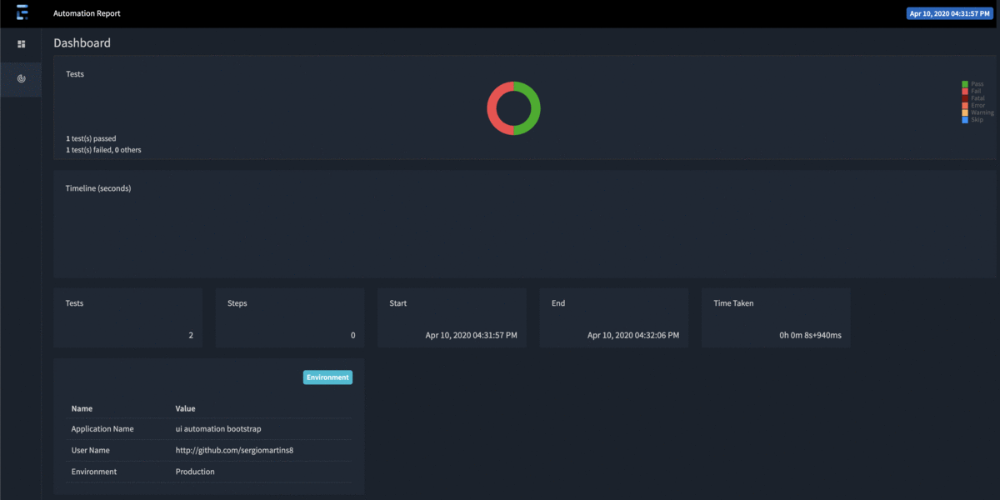

[](http://www.oracle.com/technetwork/java/javase/downloads/index.html)
[](http://www.apache.org/licenses/LICENSE-2.0)
[](https://github.com/sergiomartins8/ui-automation-bootstrap/graphs/contributors)
[](https://github.com/sergiomartins8/ui-automation-bootstrap/issues)


# ui-automation-bootstrap

A foundation for selenium based ui automation projects using _[selenide](https://github.com/selenide/selenide)_ ✨

* [About](#about)
* [Getting Started](#getting-started)
* [Documentation](#documentation)

## What does a _ui-automation-bootstrap_ test look like?

This is a sample test where a user logs in, waits the page to be loaded and checks if the side bar is visible:

```java
@Test
@Mock(path = {"/mocks/example-expectation.json"})
public void testExample() {
    open("example.com/login")
    new LoginPage()
            .login("username", "password")
            .waitPageLoaded()
            .sideBar()
            .self()
            .shouldBe(Condition.visible);
}
```

## About

The goal is to build a solid and generic foundation so that Test Automation Engineers as myself are able to bootstrap new or on going ui Selenium based automation projects with ease.

##### Using the goods of 
* _[Selenide](https://github.com/selenide/selenide)_ - A selenium wrapper for concise UI tests
* _[WebDriverManager](https://github.com/bonigarcia/webdrivermanager)_ - Downloads the required driver during runtime. May be configured on `DriverContext` under `/base`
* _[MockServer](https://www.mock-server.com/) 🐳_ - Enables the ability to mock _http_ requests and responses (check [mocking](#mocking-requests-and-responses) section)
* _[ExtentReports](https://extentreports.com/)_ - Provides full test reports. Takes screenshots upon test failure by default (check [reports](#reports) section)
* _[SonarQube](https://www.sonarqube.org/) 🐳_ - A static analysis tool. Executable through `$ mvn sonar:sonar -Dsonar.host.url=http://<<docker_ip>>:9090`
* _[SeleniumGrid](https://github.com/SeleniumHQ/docker-selenium) 🐳_ - Allows to scale the test executing as well as providing the required browser types
* _[Checkstyle](https://maven.apache.org/plugins/maven-checkstyle-plugin/)_ - Code linter. Executable through `$ mvn validate`

> _🐳 stands for dockerized_

## Getting Started

```shell script
$ git clone https://github.com/sergiomartins8/ui-automation-bootstrap.git
$ cd ui-automation-bootstrap/
$ docker-compose up -d
$ mvn test -Dtestnames=Example
```

### Runtime properties

Configurable on `pom.xml`

````shell script
$ mvn test -Dtestnames=Example [-Dbrowser=chrome|firefox] [-Dparallel=methods|classes|tests] [-DthreadCount=n] [-Dlistener="utils.listeners.ExampleListener"] [-Denvironment="$env"]
````

> **testnames** (mandatory) - Tests to be executed (check `testng.xml`)
>
> **browser** (optional, default `chrome`) - Browser to execute tests
>
> **parallel** (optional, default `false`) - Tells testng the method of parallel test execution
>
> **threadCount** (optional, default `1`) - How many threads to use during test execution
>
> **listener** (optional, default `MockListener` and `ExtentReportListener`) - Additional listener to be used during test execution (check `testng.xml`)
>
> **environment** (optional, default `qa`) - Environment configuration to be loaded. However, it's overwritten when `run.tests.local=true`, falling back to default `local`.

## Documentation

### Configuration overview

Default configurations available under `resources/`:

|variable|path|default|description|
|----|----|----|----|
|`run.tests.local`|`tests.properties`|`true`|Running tests locally to avoid using the `RemoteWebDriver` (May be configured)|
|`browser.type`|`config/${environment}`|`chrome`|Chooses in which browser tests rare executed|
|`base.url`|`config/${environment}`|`http://google.com`|Base url; e.g. `open("")` with an empty string opens the browser on the base url|
|`screenshots`|`config/${environment}`|`false`|Selenide screenshots on test failure (However, screenshots are taken by the `ExtentReportListener`) by default|
|`headless`|`config/${environment}`|`false` on local config otherwise `true`|Test execution in headless mode|
|`remote.webdriver.url`|`config/${environment}`|`http://localhost:4444/wd/hub` (http://<<docker_ip>>:4444/wd/hub)|Selenium hub deployed through `docker-compose.yaml`|
|`mock.server.url`|`config/${environment}`|`localhost` (<<docker_ip>>)|Mock server ip deployed through `docker-compose.yaml`|
|`mock.server.port`|`config/${environment}`|`3000`|Mock server port exposed to the outside (check `docker-compose.yaml`)|

> If you add new configurations make sure you edit the `Config` builder and `ConfigReader` accordingly, under `utils/config/`.

### Mocking requests and responses

Using _[MockServer](https://www.mock-server.com/)_ it's possible to inject mocks during runtime using the `@Mock` annotation, which is extracted by the `MockListener` (under `utils/listeners/`):

````java
@Mock(path = {"path1", "path2", ...})
````

> Make sure you edit `MockListener` accordingly to match your needs.

### Reports

Reports are automatically generated using _[ExtentReports](https://extentreports.com/)_ when using the `ExtentReportListener` under `/reports`. 

In addition, and by default, screenshots are taken upon test failure and attached to the report.



## _kuddos_

Feel free reach me out on linkedin/[@sergiomartins8](https://www.linkedin.com/in/sergiomartins8/) 🙇‍🙌
