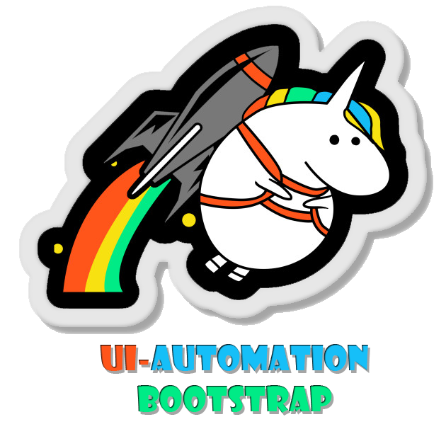
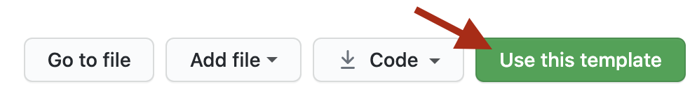

# ui-automation-bootstrap


A template for selenium based ui automation projects using _[selenide](https://github.com/selenide/selenide)_ ✨

[](https://github.com/sergiomartins8/ui-automation-bootstrap/releases)
[](https://github.com/sergiomartins8/ui-automation-bootstrap/actions?query=workflow%3Arelease-candidate)
[](https://github.com/sergiomartins8/ui-automation-bootstrap/graphs/contributors)
[](https://github.com/sergiomartins8/ui-automation-bootstrap/issues)
[](http://www.apache.org/licenses/LICENSE-2.0)

* [About](#about)
* [Getting Started](#getting-started-)
* [Changelog](#changelog)
* [Contributing](#contributing)

## What does a _ui-automation-bootstrap_ test look like?
```java
@Test
@Mock(clazz = MockExampleModel.class)
public void shouldPerformSearchSuccessfully() {
    open("http://google.com");

    googleSearchPage
            .searchComponent()
            .searchFor("dogs");

    googleResultsPage
            .searchComponent()
            .self()
            .shouldHave(value("dogs"));
}
```

## About
The goal is to build a solid and generic template so that Test Automation Engineers as myself are able to bootstrap new or ongoing ui Selenium based automation projects with ease.

##### Using the goods of 
* _[Selenide](https://github.com/selenide/selenide)_ - A selenium wrapper for concise UI tests
* _[ExtentReports](https://extentreports.com/)_ - Provides full test reports. Takes screenshots upon test failure by default
* _[SonarQube](https://www.sonarqube.org/)_ 🐳 - A static analysis tool
* _[SeleniumGrid](https://github.com/SeleniumHQ/docker-selenium)_ 🐳 - Allows to scale the test execution as well as providing the required browser types
* _[Checkstyle](https://maven.apache.org/plugins/maven-checkstyle-plugin/)_ - Code linter

> _🐳 stands for dockerized_

## Getting Started 🚀


Use this project as a template, or clone it. That easy!

## Documentation
Explore the [documentation](docs/documentation.md) and customize it for your needs.

## Changelog
Automatically generated by using [github-changes](https://github.com/lalitkapoor/github-changes).

Available [here](/docs/CHANGELOG.md).

## Contributing
Open source from the first commit ✨

Dive into ui-automation-bootstrap's [contribution guide](docs/CONTRIBUTING.md).

## Kudos
Feel free to reach out on linkedin[@sergiomartins8](https://www.linkedin.com/in/sergiomartins8/) ‍🙌
