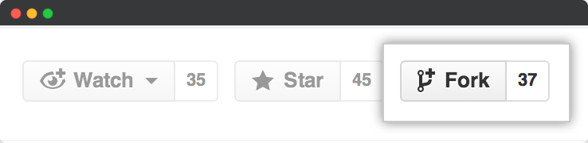

<h1 align="center">Test Automation Bootstrap</h1>

 

<i>A simple and effective boilerplate repo to quickstart test automation frameworks</i>

<a href=".docs/documentation.md"><strong>Explore the docs »</strong></a>
 
 
<a href="https://github.com/sergiomartins8/test-automation-bootstrap/issues">Ask Question</a>
·
<a href="https://github.com/sergiomartins8/test-automation-bootstrap/issues">Report Bug</a>
·
<a href="https://github.com/sergiomartins8/test-automation-bootstrap/issues">Request Feature</a>

---

### About
The goal is to have this repo with boilerplate code in a way that anyone can quickstart a variety of automation frameworks, from functional to non-functional testing.

### Features
* User interface testing (_java_) containing:
  * Code checkstyle
  * Customizable testing suites
  * Lombok (boilerplate code generator)
  * Capabilities to run mocked tests
  * HTML reports
  * Selenide (selenium webdriver library)
* Selenium Grid 🐳
* Jenkins templates (kubernetes compatible!)
* Sonarqube 🐳
* Elastic Stack 🐳
  * Distributed Test Reporting
  * Service Monitoring

> 🐳 stands for _Dockerized_.

### Getting Started 🚀

Fork this project, or clone it. That easy!

### Documentation
Explore the [documentation](.docs/documentation.md) and tailor the features available according to your needs.

### Changelog
Available [here](.docs/CHANGELOG.md).

> Automatically generated by using [github-changes](https://github.com/lalitkapoor/github-changes).

### Contributing
Open source from the first commit ✨

Dive into the [contribution guide](.docs/CONTRIBUTING.md).
