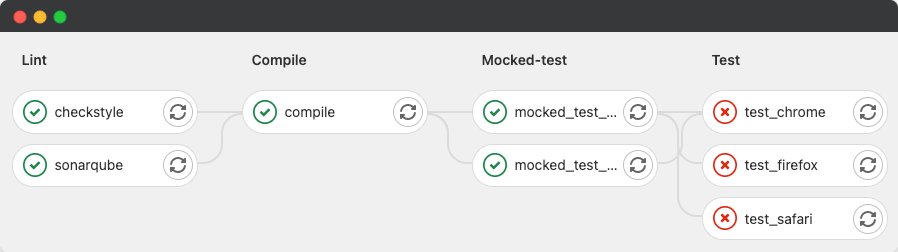

## Elastic Stack

### Distributed Test Reporting

What happens if you run multiple test suites in parallel? Would you want to get a single report for the whole run of a report for each failed suite? Also, what if they're all failing? 🤔👇



To solve the above (and other reporting vizualization issues), you can use ELK stack to serve as your reporting tool. It will provide you with a distributed log aggregator with an integrated visualization platform.

> Check out the related distributed test reporting article on [medium](https://medium.com/@sergiomartins8/distributed-test-reporting-using-elk-stack-97dd699d6bb4).

#### About
Stack Version: [7.10.1](https://www.elastic.co/blog/elastic-stack-7-10-1-released)
> You can change Elastic Stack version by setting `ELK_VERSION` in `.env` file and rebuild your images. Any version >= 7.0.0 is compatible with this template.

This allows you to build your own distributed test reporting dashboards using pie charts, timeline analysis, and all other kinds of desired visualizations. 
The options are endless.

#### Requirements
- [Docker 17.05 or higher](https://docs.docker.com/install/)
- [Docker-Compose 3 or higher](https://docs.docker.com/compose/install/)
- 4GB RAM (For Windows and MacOS make sure Docker's VM has more than 4GB+ memory.)

#### Setup
1. Initialize Elasticsearch Keystore and TLS Self-Signed Certificates
```shell script
$ make setup
```
> **For Linux's docker hosts only**. By default virtual memory [is not enough](https://www.elastic.co/guide/en/elasticsearch/reference/current/vm-max-map-count.html) so run the next command as root `sysctl -w vm.max_map_count=262144`
2. Start ELK Stack
```shell script
$ make elk           <OR>         $ docker-compose up -d
```
3. Visit Kibana at [https://localhost:5601](https://localhost:5601) or `https://<your_public_ip>:5601`

Default Username: `elastic`, Password: `kibana`

> - Notice that Kibana is configured to use HTTPS, so you'll need to write `https://` before `localhost:5601` in the browser.
> - Modify `.env` file for your needs, most importantly `ELASTIC_PASSWORD` that setup your superuser `elastic`'s password, `ELASTICSEARCH_HEAP` & `LOGSTASH_HEAP` for Elasticsearch & Logstash Heap Size.

Whatever your host (e.g AWS EC2, Azure, DigitalOcean, or on-premise server), once you expose your host to the network, ELK component will be accessible on their respective ports.

#### Setting Up Keystore
You can extend the Keystore generation script by adding keys to `./setup/keystore.sh` script. (e.g Add S3 Snapshot Repository Credentials)

To Re-generate Keystore:
```shell script
$ make keystore
```

#### Enable SSL on HTTP
By default, Transport Layer has SSL enabled as well as SSL on HTTP layer.

> ⚠️ Since SSL on HTTP layer is enabled, it will require that all clients that connect to Elasticsearch have to configure SSL connection for HTTP, this includes all the current configured parts of the stack (e.g Logstash, Kibana, Curator, etc) plus any library/binding that connects to Elasticsearch from your application code.

#### Example (based on the _[ui-tests](../ui-tests)_ boilerplate)
In order to send out your logs to logstash use the [DistributedReportListener](../ui-tests/src/test/java/io/company/utils/listeners/DistributedReportListener.java) class. It has a base implementation, but tailor it accordingly. Execute as examplified below.

```shell script
$ mvn clean test -Dlistener=${package}/utils/listeners/DistributedReportListener.java
```

### Service Monitoring
If you want to monitor multiple services to percieve their availability, you can use [heartbeat](https://www.elastic.co/beats/heartbeat) template which is already compatible with the ELK stack, described above, using the following commands:

```shell script
$ make monitoring     <OR>     $ docker-compose up beartbeat -d
```

> **NOTE**: Edit the [heartbeat.yml](heartbeat/config/heartbeat.yml) configuration file according to your needs.
