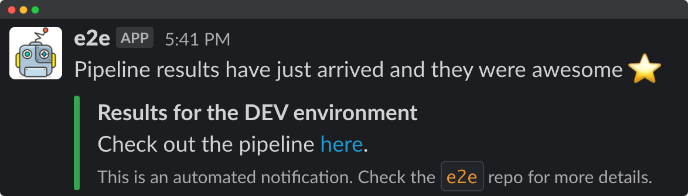

## Slack
Nowadays you can integrate with slack using pretty much every git repository or CI tool. However, if you feel like you want to take the full control and setup your own custom notifications this is for you. Thus, follow the steps below in order to use the template provided.

### Create an app
You'll need to create a slack bot app to post out notifications to your channels (install the app on the required channel if it's a private one).

Follow this great [tutorial](https://github.com/slackapi/python-slack-sdk/tree/main/tutorial) in order to setup your slack bot app.

### Custom notifications
Then you can integrate the [slack_notifier.py](slack_notifier.py) in your CI pipeline to post notifications as examplified below.




> Snippet using gitlab pipelines
```yaml
nofity_results:
  stage: notify
  image: sergiomartins8/jenkins-slave-base:latest
  script:
    - pip install slack_sdk
    - ./scripts/slack/slack_notifier.py
```
