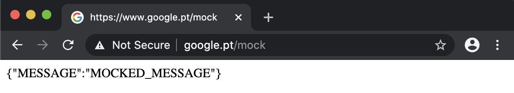

## UI Tests
Built with _java-maven_ using the goods of [Selenide](https://selenide.org/), [TestNG](https://testng.org/doc/), [ExtentReports](https://extentreports.com/), [Checkstyle](https://maven.apache.org/plugins/maven-checkstyle-plugin/), [Lombok](https://projectlombok.org/), and some others. Here you'll find the boilerplate code you need to have your ui testing framework up and ready in no time.

### POM - the Page Object Model

The *ui-tests* uses the [Page Object Model](https://martinfowler.com/bliki/PageObject.html) to structure and organize its code. 


Within page objects you may find two kinds:
1. `Pages` complete page (eg. login page, home page)
1. `Components` reusable components within a page (eg. search bar, login form)

> **NOTE:** components are not supposed to be restricted to single pages. Components are designed to be reused throughout the framework. 
> Thus, if you've to group them, group them by component type, not page; eg. forms, sidebars, modals.

### Suites
You can have multiple suites under [/suites](src/test/resources/suites). And, in order to run any of them you can use a system property `-Dsuite=<suite-name>`.

```shell script
$ mvn clean test -Dsuite=<suite-name>
```

> You can change the default suite on [pom.xml](pom.xml) properties.

### Parallel Test Execution
You can run tests in parallel, configuring your suite file or with system properties.
 
 ```shell script
$ mvn clean test -Dparallel=<method-name> -Dthread.count=<n-threads>
```

### Extent Reports
Using [ExtentReports](http://www.extentreports.com/), you are able to automatically generate reports after test execution. These are stored under `reports/ExtentReport.html`. 
Furthermore, and by default, screenshots are taken upon test failure and attached to the report.

> ⚠️ Requires the extent report listener property to be set.
>
> Example: `-Dlistener=${package}/utils/listeners/ExtentReportListener.java`

### Mocking Responses
In order to mock http requests the framework uses browserup proxy behind selenide. This allows you to intercept, filter and manipulate requests and responses.



First you've to model your request, so you can work with it anyhow you see fit. 
Therefore, in order to create a new object to model a mocked request (eg. `ExampleMockModel.java`) it has to implement [MockDefinition](src/test/java/io/company/utils/mocks/MockDefinition.java) interface.

````java
public class ExampleMockModel implements MockDefinition { ... }
````

Then, use the [@Mock](src/test/java/io/company/utils/mocks/Mock.java) annotation in order to apply it for a given test case.

##### Snippet
```java
@Target(ElementType.METHOD)
@Retention(RetentionPolicy.RUNTIME)
public @interface Mock {
    Class<? extends MockDefinition>[] clazz();
}
```

The annotation may be declared for methods or class types.

````java
@Test
@Mock(clazz = {ExampleMockModel.class, OtherExampleMockModel.class})
public void exampleMockedTest() { ... }
````

⚠️ For this to work you have to enable the proxy and use the [MockListener](src/test/java/io/company/utils/listeners/MockListener.java) class.

```shell script
$ mvn clean test -Dselenide.proxyEnabled=true -Dlistener=${package}/utils/listeners/MockListener.java
```

> **NOTE:** safari does not support this use case.

### Checkstyle
This feature integrates your project with a code linter, so that everyone follows the same code style within the team. 

```shell script
$ mvn validate
```